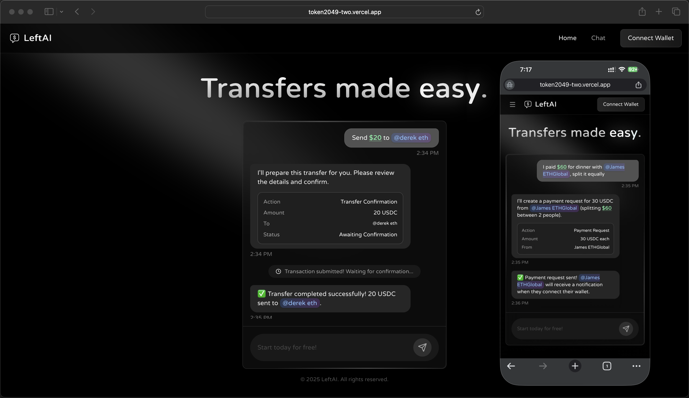

# LeftAI

**Natural Language Crypto Transactions on Celo MiniPay**

**AI-powered transaction assistant built as a Celo MiniPay MiniApp with conversational interface**

Check out the live demo of **LeftAI**: 👉 [Click here to try it out](https://token2049-two.vercel.app/)

> **📱 MiniPay MiniApp:** This is a Celo MiniPay MiniApp optimized for mobile! Open the link in MiniPay browser for the best experience.

## MiniPay MiniApp Experience 📱

LeftAI is built as a Celo MiniPay MiniApp - a mobile-first application optimized for MiniPay's mobile wallet ecosystem. The interface provides an intuitive, chat-based interaction for crypto transactions on the go.

<p align="center">
  
  
</p>

## PWA Web Experience 💻

LeftAI also works as a Progressive Web App, providing a seamless experience across desktop and mobile browsers with full wallet integration.



## Demo Video
[🎥 Watch Demo Video](#)

## Inspiration: How We Came Up With This Idea 💡

We noticed that blockchain transactions are still too complex for mainstream adoption. Users need to:
- Copy-paste long wallet addresses (prone to errors)
- Calculate amounts manually
- Navigate multiple DeFi protocols
- Understand complex terminology

> *"What if you could just say 'Send $10 to Alice' and it happens?"*

That question sparked LeftAI. By combining natural language processing with AI function calling (powered by Phala's confidential computing network), contact management, and smart contract automation, we created an interface where anyone can execute crypto transactions as easily as sending a text message.

This exploration led us to build LeftAI as a **Celo MiniPay MiniApp** - a mobile-first, PWA-optimized application that:

- **Understands natural language commands** using RedPill AI (Phala Network)
- **Resolves contacts automatically** with @mentions (like Twitter/Slack)
- **Converts USD to crypto** using $ notation for intuitive amounts
- **Splits bills intelligently** with AI-powered calculation
- **Enables CELO staking** through custom smart contracts
- **Executes transactions securely** with MetaMask integration
- **Provides real-time feedback** with explorer links and confirmations
- **Works seamlessly on mobile** as a MiniPay-integrated PWA

## Features ✨

### 1. **Natural Language Transactions**
- Send crypto using plain English: *"Send $10 to @Alice Johnson"*
- AI extracts parameters and prepares transactions
- Smart parameter collection for missing information

### 2. **Contact Integration**
- Type `@` to select contacts with autocomplete
- No more copy-pasting addresses
- Contact names automatically resolve to wallet addresses

### 3. **USD Denomination**
- Type `$10` to send 10 USDC
- Simple 1:1 conversion for easy mental math
- Supports USDC, CELO, cUSD, cEUR

### 4. **Bill Splitting**
- *"I paid $60 for dinner with @Bob and @Carol, split it equally"*
- AI calculates individual shares
- Sends payment requests to all participants
- Notification system for requests

### 5. **CELO Staking**
- *"I want to stake 10 CELO to earn rewards"*
- Custom SimpleStaking contract (1:1 CELO:stCELO)
- Single transaction, no complex steps
- Deployed at: `0x95Cb4F3CA3c7B5d1fD2577Ce47F65c15b4521Fa7`

### 6. **Account Balance**
- View USDC and CELO balances
- Direct link to Celoscan explorer
- Real-time balance updates

## Getting Started 🚀

### Frontend Setup

Clone the repository and start the development server:

```bash
git clone https://github.com/derek2403/token2049.git
cd token2049/frontend
npm install
npm run dev
```

### Environment Variables

Create a `.env.local` file in the `frontend` directory:

```env
# RedPill AI API (Phala Network)
REDPILL_API_KEY=your_redpill_api_key_here

# Layerswap API
LAYERSWAP_API_KEY=your_layerswap_api_key_here

# Squid Router API
SQUID_INTEGRATOR_ID=your_squid_integrator_id_here
```

### Smart Contract Deployment

Deploy the SimpleStaking contract:

```bash
cd contract
npm install
# Add your PRIVATE_KEY to .env
npm run deploy:staking
```

## System Architecture 🏗️

```
┌─────────────────┐
│   User Input    │
│  "Send $10 to   │
│  @Alice"        │
└────────┬────────┘
         │
         ▼
┌─────────────────────────────┐
│   Frontend Processing       │
│  • @ → Wallet Address       │
│  • $ → USDC Amount          │
└────────┬────────────────────┘
         │
         ▼
┌─────────────────────────────┐
│   RedPill AI (Phala)        │
│  • Parse intent             │
│  • Extract parameters       │
│  • Call function            │
└────────┬────────────────────┘
         │
         ▼
┌─────────────────────────────┐
│   Smart Contract Execution  │
│  • Transfer USDC            │
│  • Stake CELO               │
│  • Request Payment          │
└────────┬────────────────────┘
         │
         ▼
┌─────────────────────────────┐
│   Blockchain Confirmation   │
│  • MetaMask signature       │
│  • Transaction on Celo      │
│  • Explorer link            │
└─────────────────────────────┘
```

## Technology Stack 🛠️

### Frontend
- **Next.js 15** - React framework with App Router
- **Wagmi 2.x** - React Hooks for Ethereum
- **RainbowKit** - Wallet connection UI
- **Viem** - TypeScript interface for Ethereum
- **TailwindCSS** - Utility-first styling
- **Framer Motion** - Animations
- **Radix UI** - Accessible components
- **shadcn/ui** - UI component library

### Backend & APIs
- **RedPill AI (Phala Network)** - Confidential AI computation
- **OpenAI-compatible API** - Function calling interface
- **Layerswap API** - Cross-chain bridging
- **Squid Router** - DEX aggregation
- **Celoscan API** - Blockchain data

### Smart Contracts
- **Solidity 0.8.20+** - Smart contract language
- **Hardhat** - Development environment
- **OpenZeppelin** - Secure contract libraries
- **Celo Mainnet** - Deployment network

### Blockchain & Web3
- **Celo** - Layer 1 blockchain
- **Celo MiniPay** - Mobile wallet integration
- **USDC** - Primary stablecoin
- **RainbowKit** - Multi-wallet support (MiniPay, MetaMask, etc.)
- **ERC-4626** - Vault standard

## Smart Contracts 📜

### Staking Contract
**Address:** `0x95Cb4F3CA3c7B5d1fD2577Ce47F65c15b4521Fa7` (Celo Mainnet)

A simple 1:1 staking contract for CELO tokens:
- `stake()` - Deposit CELO, receive stCELO (1:1)
- `unstake(uint256)` - Burn stCELO, receive CELO back
- ERC20 compliant stCELO token

**View on Celoscan:** [0x95Cb...1Fa7](https://celoscan.io/address/0x95Cb4F3CA3c7B5d1fD2577Ce47F65c15b4521Fa7)

## AI Agent Functions 🤖

LeftAI uses function calling to execute blockchain operations:

### 1. **Transfer Funds** (`transfer_funds`)
```javascript
Input: "Send $10 to @Alice Johnson"
AI Calls: transfer_funds(destinationAddress, amount: "10", tokenSymbol: "USDC")
Result: Transfers 10 USDC to Alice's wallet
```

### 2. **Request Payment** (`request_payment`)
```javascript
Input: "I paid $60 for dinner with @Bob and @Carol, split it equally"
AI Calls: request_payment(fromAddresses: [Bob, Carol], individualAmounts: {Bob: 20, Carol: 20}, tokenSymbol: "USDC")
Result: Sends payment requests to Bob and Carol for 20 USDC each
```

### 3. **Stake CELO** (`stake_celo`)
```javascript
Input: "I want to stake 10 CELO to earn rewards"
AI Calls: stake_celo(amount: "10")
Result: Stakes 10 CELO via SimpleStaking contract, receives 10 stCELO
```

## Key Features Implementation 💻

### Contact System
- **Autocomplete**: Type `@` to search contacts
- **Auto-resolve**: Frontend replaces `@Alice Johnson` with `0x1C4e...D6C6`
- **Cursor-like UX**: Dropdown with fuzzy search

### Currency Conversion
- **USD notation**: `$10` automatically converts to `10 USDC`
- **1:1 ratio**: Simple mental math
- **Multiple tokens**: Supports USDC, CELO, cUSD, cEUR

### AI Processing Flow
```
User Input → Contact/USD Replacement → RedPill AI → Function Call → Validation → Confirmation UI → MetaMask → Blockchain
```

## Important Endpoints 📍

### Frontend API Routes
- **AI Chat Processing**  
  `/pages/api/chat.js`

- **Squid Router Integration**  
  `/pages/api/squid-route.js`  
  `/pages/api/squid-status.js`

- **Notification System**  
  `/pages/api/notifications.js`

### LLM Actions (AI Functions)
- **Transfer Logic**  
  `/lib/llmActions/executeTransfer.js`

- **Payment Requests**  
  `/lib/llmActions/requestPayment.js`

- **CELO Staking**  
  `/lib/llmActions/stakeCelo.js`

- **Function Registry**  
  `/lib/llmActions/index.js`

### Smart Contracts
- **SimpleStaking Contract**  
  `/contract/contracts/SimpleStaking.sol`

- **Deployment Scripts**  
  `/contract/scripts/deploySimpleStaking.js`

## Project Structure 📁

```
token2049/
├── frontend/                 # Next.js application
│   ├── components/          # React components
│   │   ├── navbar.js       # Navigation with balance modal
│   │   ├── contact-autocomplete.js
│   │   └── notification-toast.js
│   ├── pages/
│   │   ├── index.js        # Landing page with demo
│   │   ├── chat.js         # Main chat interface
│   │   └── api/            # API routes
│   ├── lib/
│   │   ├── llmActions/     # AI function definitions
│   │   ├── currencyUtils.js
│   │   └── swapUtils.js
│   ├── hooks/
│   │   └── useContacts.js
│   ├── public/
│   │   └── data/
│   │       └── contacts.json
│   └── .env.local          # Environment variables
│
└── contract/                # Smart contracts
    ├── contracts/
    │   └── SimpleStaking.sol
    ├── scripts/
    │   └── deploySimpleStaking.js
    └── deployments/
        └── simple-staking.json
```

## Testing Guide 🧪

### Test Prompts

1. **Send Funds**
   ```
   Send $0.01 to @Alice Johnson
   ```

2. **Split Bills**
   ```
   I paid $60 for dinner with @Bob Smith and @Carol Lee, split it equally
   ```

3. **Stake CELO**
   ```
   I want to stake 1 CELO to earn rewards
   ```

## Deployment 🚢

### Frontend (Vercel as MiniPay MiniApp)
```bash
cd frontend
npm run build
# Deploy to Vercel
# Access via MiniPay browser or any mobile device
```

**MiniPay MiniApp Integration:**
- Built as a Celo MiniPay MiniApp optimized for mobile wallet experience
- Works as a Progressive Web App (PWA)
- Supports MiniPay wallet alongside MetaMask and other Web3 wallets

### Smart Contracts (Celo Mainnet)
```bash
cd contract
# Add PRIVATE_KEY to .env
npm run deploy:staking
```